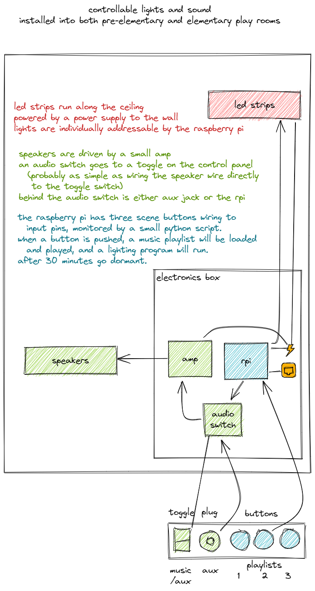
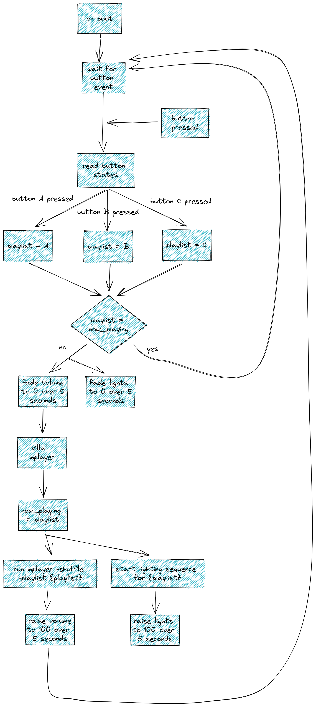

# Room Lights and Sound

## Purpose

This project creates three user-controller light and sound themes.

## High-Level Overview

# Parts List

- Speakers Option A
  - Regular Speakers - $5-$30 ea depending on wattage and frequency response
  - Audio Amplifier
    - 25W - RPI hat, $25 [example](https://www.amazon.com/dp/B07CZZ95B9/)
    - 300W - external amp, $75
- Speakers Option B
  - Commercial overhead speakers, $30 ea [example](https://www.amazon.com/JBL-CSS8008-Commercial-15-Watt-Ceiling/dp/B004W4EB9G/)
  - 25/70V PA Amplifier, $80 [example](https://pyleusa.com/products/pcm20a)
- Individually addressable 12v lighting strip
  - $2/ft
  - strips with WS2812B chips are good, [example](https://randomnerdtutorials.com/micropython-ws2812b-addressable-rgb-leds-neopixel-esp32-esp8266/)
- Controller Option A - Raspberry PI
  - Usually $30-50, 2022 chip shortage $100+
  - Perhaps Cameron has some spares at home?
  - Less complex script, but is a fully-functioning computer inside.
- Controller Option B - Microprocessor (Arduino)
  - Arduino board, $30 [example](https://www.amazon.com/Arduino-A000066-ARDUINO-UNO-R3/dp/B008GRTSV6/)
  - MP3 board, $30 [example](https://www.amazon.com/SparkFun-Shield-decoder-Compatible-Functional/dp/B09NJQBG99/)
  - More complex program, but is a single-purpose device and possibly more stable.
- Control Panel
  - 3x momentary push buttons, [example](https://www.amazon.com/Twidec-AC250V-Momentary-Pre-soldered-R13-507BKR-X/dp/B08JHSG717/)
  - toggle switch, A-B or On-Off-On [example](https://www.amazon.com/Twidec-Momentary-Miniature-Waterproof-MTS-123-MZ/dp/B07VHCB1Q4/)
  - aux jack for control panel, [example](https://www.amazon.com/YinXiong-5-Pack-Keystone-Earphone-Adapter/dp/B07GTM82FD/)
  - Keystone plate, with a few extra open spots for future expansion
  - USB phone charger nearby
    - thunderbolt, usb c, usb micro a
- Assorted wire and speaker jacks

## Program

The control program running on the Raspberry PI should have functionality similar to this.

